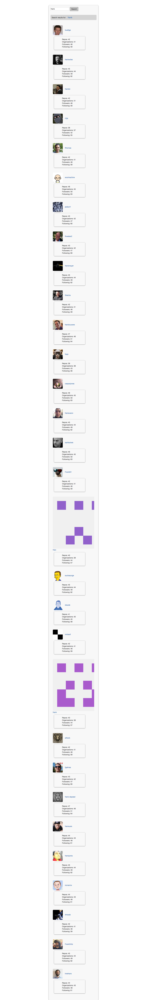

#testProject5  -- ANGULAR (practice round)

 > heroku app => http://githubprofiles.herokuapp.com/

##app deployed to heroku - pre-heroku is testProject3

 Grunt.js, Sass

    

Setup Grunt.js and Sass folder/files

Processed/tested Grunt uglify to minimize my javascript files - ok
